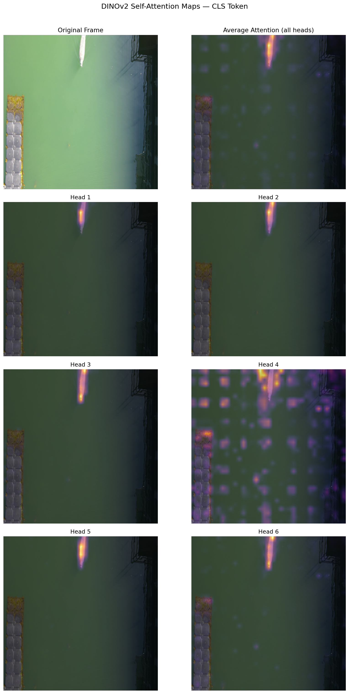
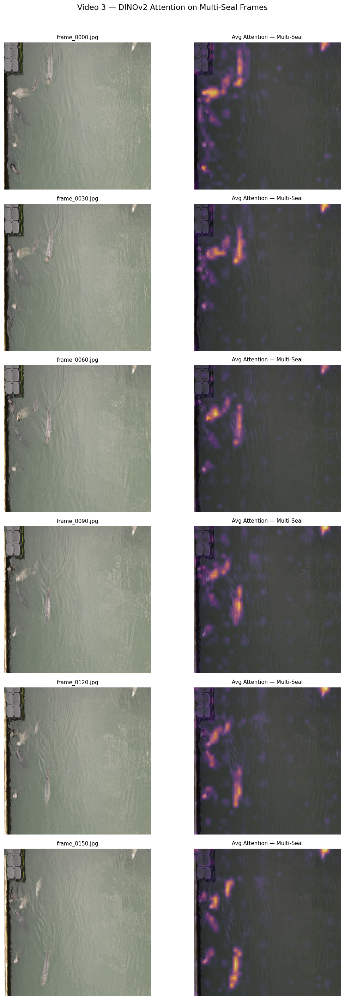
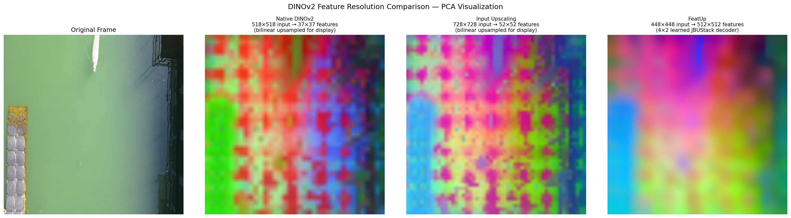
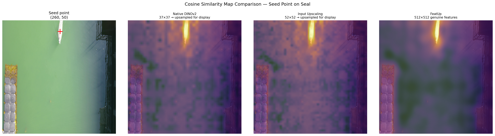
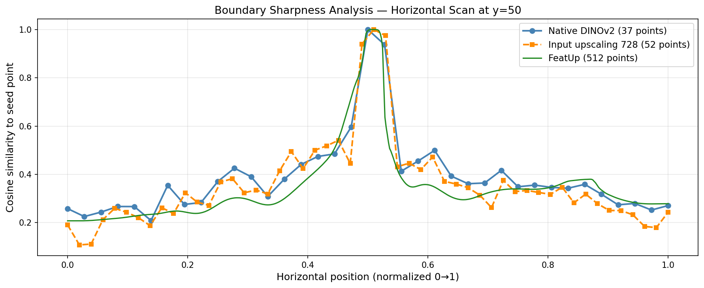

# Seal Tracking with DINOv2

Unsupervised seal tracking using DINOv2 self-supervised vision transformer features - no labels, no annotations, no training. This project explores whether DINOv2's internal representations can localize and track individual seals in underwater video purely through feature similarity and attention.


## Motivation

Annotating marine animal videos is time-consuming and yields very limited labeled data. Recent self-supervised vision transformers like DINOv2 learn rich visual representations without any labels. This project asks: can those representations alone be used to track seals in underwater footage?

## Key Results

### Attention Maps: Zero-Guidance Seal Localization
DINOv2's self-attention heads naturally highlight the seal with no manual input. The CLS token (the model's global summary) attends strongly to the seal body across all frames.



*Six attention heads on a single frame. Head 3 most consistently highlights the full seal body.*

---

### Attention Consistency Across Frames
Attention remains focused on the seal throughout the video. When the seal exits the frame, attention shifts to the next most visually salient object rather than diffusing across background water.

---

### Multi-Seal Attention in Video 3
On footage with multiple seals, attention highlights all seals simultaneously with no guidance. Attention weakens proportionally when seals are partially submerged, accurately reflecting reduced visual distinctiveness.



---

### FeatUp: High Resolution Feature Maps
Native DINOv2 produces a coarse 37×37 feature grid (one vector per 14×14 patch). FeatUp's learned decoder upsamples this to 512×512 genuine pixel-level features via four ×2 stages (32→64→128→256→512).



*Left to right: original frame, native DINOv2 PCA (37×37 upsampled), input upscaling 728×728 (52×52 upsampled), FeatUp (512×512 genuine). FeatUp shows the sharpest seal boundary with no blockiness.*

---

### Similarity Map Comparison
Cosine similarity from a seed point on the seal body. Native DINOv2 and input upscaling both show a "candle glow" bleed into surrounding water — an artifact of upsampling coarse patch features. FeatUp eliminates this entirely.



---

### Boundary Sharpness Analysis
Plotting similarity values along a horizontal scan line crossing the seal/water boundary. Native DINOv2 shows a staircase pattern (discrete patch steps). Input upscaling improves this but remains patch-limited. FeatUp shows a steep, smooth drop at the actual boundary.



---

### Single Seal Tracking
Similarity-based tracking with motion constraints. The tracker maintains a bounding box across frames using cosine similarity to a reference feature and a search radius centered on the previous position.

| Video 1 — 518×518 | Video 1 — 728×728 |
|---|---|
|  |  |

---

### Multi-Seal Tracking
Tracking multiple seals simultaneously using connected component detection and nearest-center ID assignment. KMeans splitting was tested but reverted, it improved some merged detections but introduced more ID switches. Nearest-center tracking is the more stable baseline.


## Key Findings
 
- DINOv2 attention maps localize seals with zero manual input — no seed points, no annotations needed
- Attention weakens proportionally when seals are partially submerged, accurately reflecting reduced visual distinctiveness
- FeatUp produces genuinely sharper boundaries than simple input upscaling — confirmed visually (PCA, similarity maps) and quantitatively (boundary sharpness plot)
- Similarity-based tracking works well for single seals; multi-seal tracking is harder because DINOv2 features for same-species animals are visually similar, making identity assignment ambiguous during overlap or submersion
- Attention and similarity are complementary: attention needs no reference but has no temporal memory; similarity can target specific body parts but requires manual seed selection

## Setup

```bash
git clone https://github.com/Kanakjyoti/seal-tracking-dino.git
cd seal-tracking-dino
python -m venv venv
source venv/bin/activate        # Windows: venv\Scripts\activate
pip install torch torchvision
pip install numpy matplotlib opencv-python pillow scikit-learn
pip install git+https://github.com/mhamilton723/FeatUp
```

Notebooks 01 was run locally on an AMD Ryzen 5 5600H with NVIDIA RTX 3050 (4GB VRAM). Notebooks 02–05 were run on Google Colab (Tesla T4, 15GB VRAM) due to memory requirements at higher resolutions.

Data (raw videos and extracted frames) is not included in this repository due to file size. Place raw videos in `data/raw_videos/` and extracted frames in `data/frames/`.

## References

- Caron et al. *Emerging Properties in Self-Supervised Vision Transformers.* ICCV 2021. [arXiv:2104.14294](https://arxiv.org/abs/2104.14294)
- Oquab et al. *DINOv2: Learning Robust Visual Features without Supervision.* TMLR 2024. [arXiv:2304.07193](https://arxiv.org/abs/2304.07193)
- Fu et al. *FeatUp: A Model-Agnostic Framework for Features at Any Resolution.* 2024. [arXiv:2403.10516](https://arxiv.org/abs/2403.10516)
